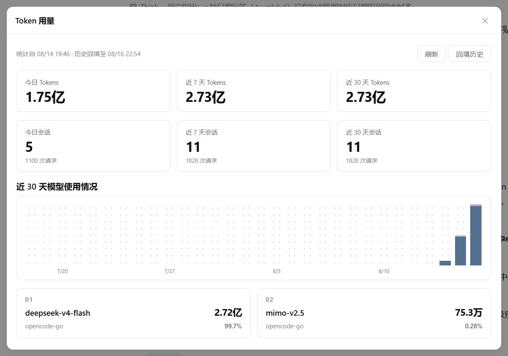

# dsh-token-monitor

<p align="center">
  <a href="README.zh-CN.md">简体中文</a> | <strong>English</strong>
</p>

A [DeepSeek Harness](https://github.com/deepseek-ai/deepseek-harness) plugin that shows your **token usage and conversation stats** as a native settings page (**Settings → Token 用量 / Token Usage**): today / 7-day / 30-day token totals, a GitHub-style 90-day contribution graph, and conversation counts.



## Features

- 📊 **Metric cards** — today / 7 days / 30 days token totals with Chinese units (万 / 亿), big-number only, no clutter.
- 📈 **GitHub-style contribution graph** — last 90 days, stretches across the full content width; 5-level color intensity by daily token volume; hover a cell for the per-day breakdown (input / output / cache / requests).
- 💬 **Conversation stats** — top-level conversations opened today / 7 days / 30 days (subagent sessions excluded), with the corresponding model request counts.
- 🔄 **Auto refresh** — 30 s polling plus manual "刷新 / Refresh" and "回填历史 / Backfill" buttons.
- 💾 **Persistence** — buckets are written to `$DSH_HOME/plugins/token-usage/data.json` and survive restarts (91-day daily buckets).
- 🕘 **Historical backfill** — on startup (or on demand) the plugin scans session logs via `sessionQuery`, so usage from *before* the plugin was installed is included too.
- 🎨 **DSH-native styling** — light theme, 1 px hairline cards, 8–10 px radii, no shadows; colors use `--ds-*` theme variables so it follows DSH's dark theme as well.

## Install

From this repository:

```bash
dsh plugin --profile web add github:zhangzheng25/dsh-token-monitor
```

Or from a local checkout:

```bash
dsh plugin --profile web add E:\path\to\dsh-token-monitor
```

`dsh plugin` forwards to pnpm inside the profile directory and reconciles `dsh.profile.bundles`; the package's `dsh.bundle.patch` (`cordis.patch.yml`) inserts the plugin row into the host composition, and `dsh.client.platform: "web"` makes the web shell serve `client/bundle.js`.

**Restart DSH**, then open **Settings → Token 用量** (Token Usage).

## How it works

```
┌────────────────────────── Host (Node.js) ──────────────────────────┐
│ src/index.js                                                       │
│  • ctx.on('llm/stream', …)  ← waterfall: capture TokenUsage per    │
│      real model call (input / output / cache read / cache write /  │
│      reasoning) into daily buckets                                 │
│  • backfill()               ← sessionQuery scans session logs      │
│      (assistant/message usage events) for pre-install history      │
│  • buildSessionStats()      ← top-level conversation counts        │
│      (delegationDepth === 0), 20 s cache                           │
│  • persist()                ← debounced JSON write to              │
│      $DSH_HOME/plugins/token-usage/data.json                       │
│  • webServer.register('/token-usage/snapshot') ← HTTP route        │
│      consumed by the browser half (static-bundle pattern)          │
└─────────────────────────────────────────────────────────────────────┘
                          │ fetch('/token-usage/snapshot')
                          ▼
┌────────────────────────── Client (browser) ────────────────────────┐
│ client/bundle.js — hand-built web bundle following the             │
│ client-modules protocol (window.__ModuleLoader__.load)             │
│  • slots.inject('settings.section') → settings page "Token 用量"   │
│  • metric cards + contribution graph + conversation cards          │
│  • 30 s polling, refresh / backfill buttons                        │
└─────────────────────────────────────────────────────────────────────┘
```

## Data sources

- **Live**: the `llm/stream` waterfall — provider-reported `usage` chunks (`TokenUsage`), the same accounting the harness itself uses for session statistics.
- **History**: `assistant/message` usage events in session logs, read through `ctx.sessionQuery` (zstd decoding handled internally; sessions are not woken).
- **Conversations**: `sessionQuery.listSessions()` headers (`cwd`, `createdAt`, `delegationDepth`); only top-level sessions (`delegationDepth === 0`) count as conversations.

## Development

```bash
node --check src/index.js      # host half
node --check client/bundle.js  # client bundle
```

The client bundle is written by hand to match the `client-modules` bundle protocol — no build step required.

## License

[MIT](./LICENSE)
